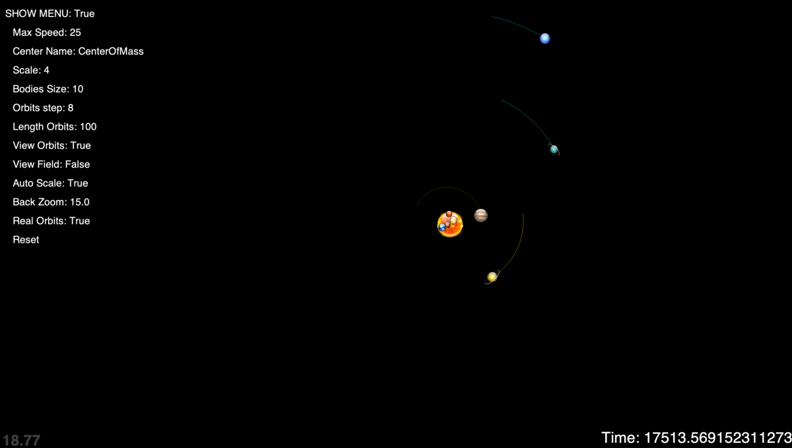
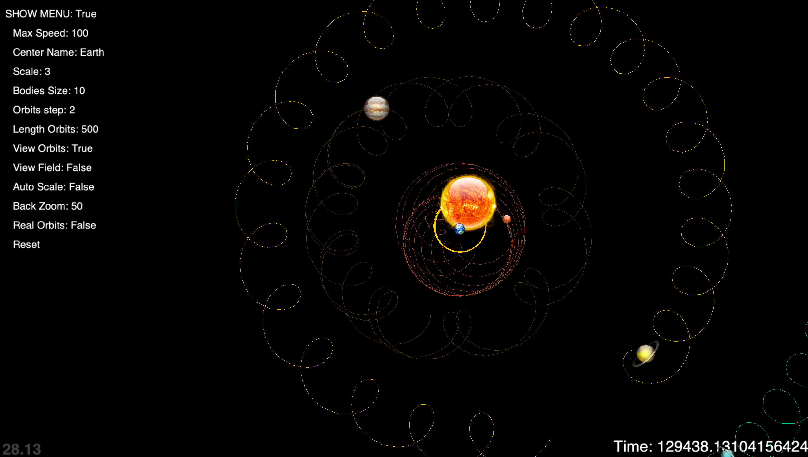

# Solar System Simulation
Is a 2d simulation of the solar system with a dynamic n-body problem, approximated to first order.
You must use an old version of pyglet to run. You can use the command `pip3 install pyglet==1.5.11`.
Try to run `sss.py` after installed libraries.

